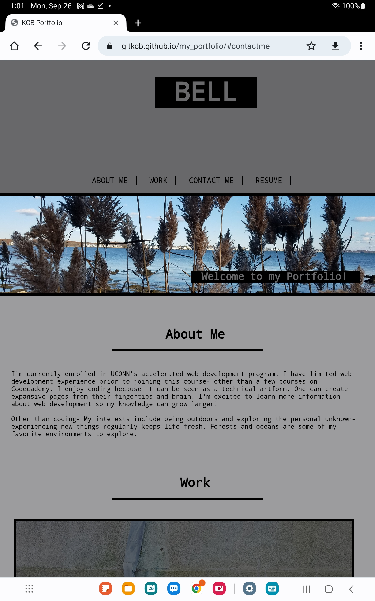
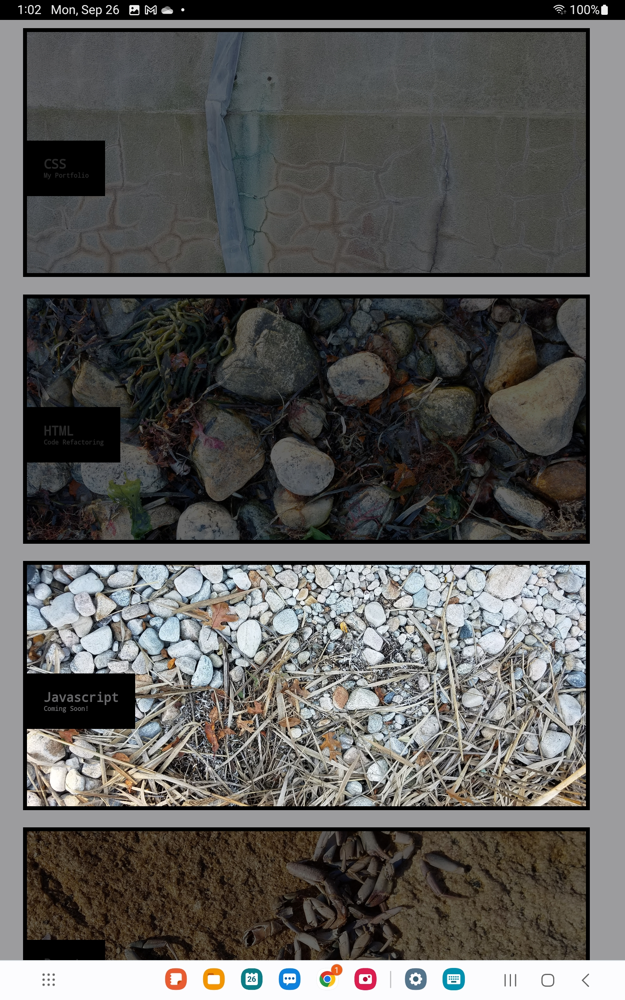
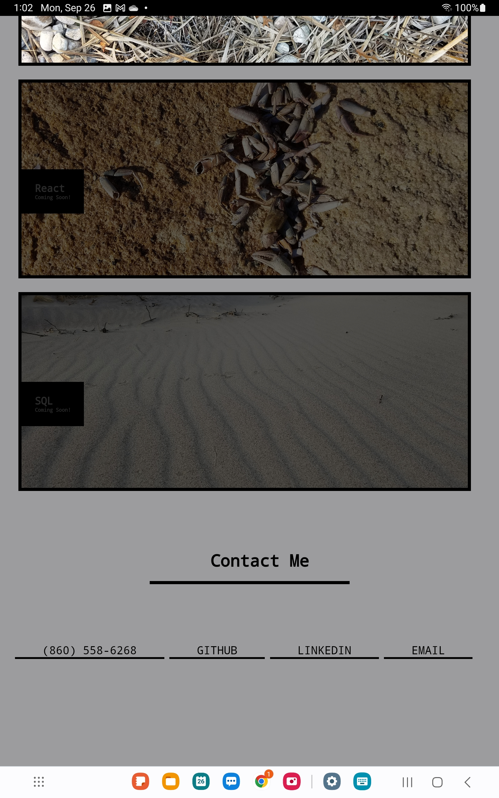

# my_portfolio

## Description
My motivation for this webpage was to create a page available to the public that showcases past work and with my information to contact me. This webpage gives solves the issue of not having a place to display past web development accomplishments. I learned about styling with CSS and how to follow acceptance criteria to build a page from scratch. 

## Usage
User can click the elements at the top of the navigation bar to be brought to that specific section. the Resume tab opens up a pdf of my resume. 
My linkedIn, GitHub, and email are linked at the bottom of the page along with my cellphone number. The boxes in the work section will be links to future accomplishments. 

screenshots from laptop:
 .png)
 .png)
 .png)
 .png)

screenshots from tablet:

screenshots from mobile device:

## Credits

List your collaborators, if any, with links to their GitHub profiles.

If you used any third-party assets that require attribution, list the creators with links to their primary web presence in this section.

If you followed tutorials, include links to those here as well.

